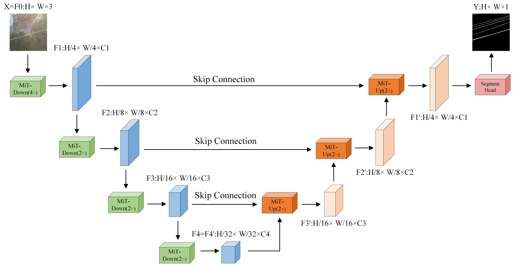

# MiT-Unet: Mixed Transformer Unet for Transmission Line Segmentation in UAV Images

## Network Architecture

## Quantitative Performance
|                                                   Method                                                    | Params(M) | FLOPs(G)  | F1score(%) |  IoU(%)   |
|:-----------------------------------------------------------------------------------------------------------:|:---------:|:---------:|:----------:|:---------:|
|                                [UNet](https://arxiv.org/pdf/1505.04597.pdf)                                 |   31.04   |  218.95   |   78.06    |   60.58   |
|   [SegFormer](https://proceedings.neurips.cc/paper/2021/file/64f1f27bf1b4ec22924fd0acb550c235-Paper.pdf)    |   27.35   | **56.70** |   72.35    |   51.10   |
|                                [Swin-Unet](https://arxiv.org/pdf/2105.05537)                                |  231.96   |  180.32   |   77.35    |   60.24   |
|                                                  MiT-Unet                                                   | **19.27** |   72.25   | **81.32**  | **65.24** |

## MiT-Unet at different scales
|                                                Method                                                 | Params(M) | FLOPs(G)  | F1score(%) |  IoU(%)   |
|:-----------------------------------------------------------------------------------------------------:|:---------:|:---------:|:----------:|:---------:|
| [MiT-Unet(b0)](https://drive.google.com/file/d/13q7i9BkVh_Uy-0yzbj22OVbilPv_tkgl/view?usp=drive_link) | **4.87**  | **18.48** |   79.51    |   62.25   |
| [MiT-Unet(b1)](https://drive.google.com/file/d/1iSpxWF0j5aYnHfoD5wl85RJj0xVlTlKY/view?usp=drive_link) |   19.27   |   73.25   |   81.32    |   65.24   |
| [MiT-Unet(b2)](https://drive.google.com/file/d/1EKhuF5UVE4vXdkVnF_jTEtbstqdsG73B/view?usp=drive_link) |   38.18   |   88.48   |   82.63    |   68.46   |
|                                             MiT-Unet(b3)                                              |   77.93   |  117.78   |   82.92    |   68.45   |
|                                             MiT-Unet(b4)                                              |  111.48   |  145.90   |   83.05    |   68.29   |
|                                             MiT-Unet(b5)                                              |  152.68   |  174.56   | **83.30**  | **69.36** |

__Note__: Because the pretrained weight of b3 and above is too large, we only provide the weight of b0 to b2.

## Result

__Note__: Visualization of segmented results on TTPLA dataset.

## Require
Please `pip install` the following packages:
- torch
- torchvision
- matplotlib
- numpy
- opencv-python
- tqdm
- pyyaml
- thop
- tensorboardX
- einops
- timm
- scikit-image

## Test:
1. Configure environment:
    
    + Creating a virtual environment in terminal: `conda create -n mitunet python=3.8`.
    
    + Installing necessary packages.
2. Test Configuration:
    + Download pretrained weight and move it into `./data/checkpoints`.
    + Set the pretraining weight path and weight scale PHI in `config.yml`, ensuring that the weights correspond to PHI, such as b0 weight with a PHI of b0.
    + Run the `./test.py` to output test results, which can be selected test images in `./data/images`.

